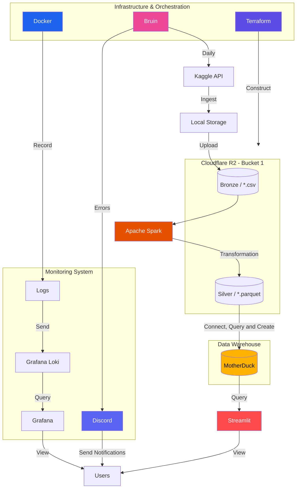
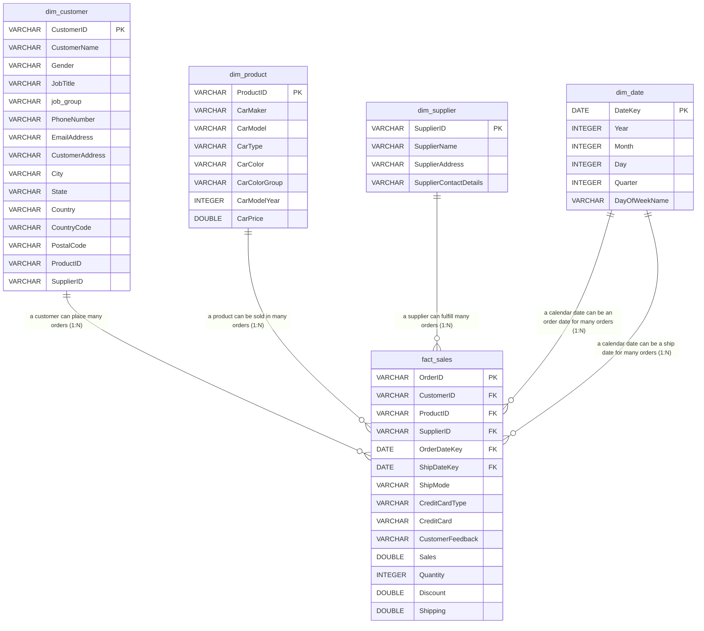

# Car Supply Chain Data Pipeline

A scalable **Data Engineering project** that builds an end-to-end pipeline for processing Car Supply Chain data, from raw ingestion to business-ready analytics.

## I. Problem Statement

While modern supply chain systems generate vast amounts of data, this information is frequently stored in inconsistent and unstructured formats, hindering effective analysis. Consequently, the report generation process remains highly complex, inefficient, and time-consuming due to the need for repetitive content revisions.

## II. Solution

To address this challenge, data pipeline will be implemented that automatically ingests, cleans, and standardizes supply chain data into a structured format and actionable insights. By integrating automated reporting templates, this solution will eliminate manual, repetitive revisions and streamline the analytical workflow.

## III. Architecture Overview



This modern data pipeline follows a Medallion Architecture managed by a robust infrastructure and monitoring system. First, Terraform provisions the Cloudflare R2 storage, while Bruin schedules the daily ingestion of raw data from the Kaggle API into Local Storage and subsequently into the Bronze R2 bucket as CSV files. Next, Apache Spark processes and transforms this raw data into optimized Parquet format within the Silver R2 bucket. This clean data is then queried by MotherDuck, acting as the cloud data warehouse.

**Relationship Diagram (Gold Layer Star Schema)**


Finally, Streamlit query to MotherDuck for creating application for end-user data visualization. Throughout this workflow, Docker container logs are collected by Grafana Loki and visualized via Grafana for continuous observability, while any pipeline errors encountered by Bruin trigger real-time alerts to users via Discord.

## IV. Tech Stack

| Layer | Technology | Key Role in Architecture |
|---|---|---|
| **Infrastructure & Orchestration** | **Terraform** | Infrastructure as Code (IaC) to provision Cloudflare R2 buckets. |
|  | **Bruin** | Data orchestrator to schedule and trigger the daily ingestion tasks. |
|  | **Docker** | Containerization to isolate services and standardise logging environments. |
| **Data Lake & Cloud Storage** | **Cloudflare R2** | Object storage hosting the Medallion architecture (**Bronze** and **Silver** layers). |
| **Data Ingestion & Processing** | **Kaggle API** | The primary external data source for the pipeline. |
|  | **Apache Spark** | Distributed compute engine used to normalize and transform CSVs into optimized Parquet files. |
| **Data Warehouse** | **MotherDuck** | Cloud-native, DuckDB-powered data warehouse for analytical queries. |
| **BI & Presentation Layer** | **Streamlit** | Python-based web framework for interactive dashboards and data viewing. |
| **Observability & Alerting** | **Grafana Loki & Grafana** | Log aggregation and visualization stack to monitor Docker container metrics. |
|  | **Discord** | Webhook integration for real-time pipeline error notifications. |

## V. Project Structure

```text
scm-data-pipeline-v2/
├── .bruin.yml                 # Bruin global configuration
├── .env                       # Environment variables configuration
├── requirements.txt           # Python application dependencies
├── README.md                  # Project documentation
│
├── data/                      # Local data cache
│   └── Car_SupplyChainManagementDataSet.csv
│
├── pipelines/                 # Data orchestration pipeline
│   ├── pipeline.yml           # Pipeline-level configuration
│   └── assets/                # Medallion layers ETL code
│       ├── bronze/            # Bronze Tier: Ingestion & storage
│       │   ├── ingest/
│       │   │   └── ingest_scm_kaggle.py
│       │   └── storage/
│       │       └── upload_to_r2.py
│       ├── silver/            # Silver Tier: Cleaning & transformation
│       │   └── data_normalization.py
│       └── gold/              # Gold Tier: Analytical modeling
│           ├── load_to_motherduck.py
│           └── queries/       # Star Schema transformation scripts
│               ├── dim_customer.sql
│               ├── dim_date.sql
│               ├── dim_product.sql
│               ├── dim_supplier.sql
│               └── fact_sale.sql
│
├── dashboard/                 # Analytics and reporting application
│   ├── app.py                 # Streamlit dashboard application
│   ├── db_queries.py          # Data retrieval layers from MotherDuck
│   └── queries/               # Dashboard analytical queries
│       ├── page_1/
│       │   ├── charts/
│       │   └── metrics/
│       └── page_2/
│           ├── charts/
│           └── metrics/
│
├── terraform/                 # Infrastructure as Code config
│   ├── main.tf                # Cloud resources definition
│   ├── variables.tf           # Terraform input parameters
│   ├── terraform.tfvars       # Terraform variable values
│   └── terraform.tfstate      # Infrastructure state file
│
└── logs/                      # Executions log directory
```

## VI. Getting Started

### Step 1: Prerequisites

Ensure you have the following installed and configured on your machine:
1. **Docker Desktop** (running on your host machine).
2. **VS Code** with the **Dev Containers** extension installed.
3. **Accounts and Credentials**:
   * **Kaggle Account** (to download the source dataset). Generate an API Token from your Kaggle Profile Settings to receive `kaggle.json` credentials (`username` and `key`).
   * **Cloudflare Account** (for R2 object storage).
   * **MotherDuck Account** (for cloud DuckDB data warehousing). Get your MotherDuck service token from the dashboard.

### Step 2: Set Up the Development Environment

1. Open the project folder in VS Code.
2. Click the green button in the bottom-left corner of VS Code (or press `Ctrl + Shift + P`) and select:
   ```bash
   Dev Containers: Reopen in Container
   ```
3. VS Code will build the Docker container and configure all development tools automatically.

### Step 3: Configure Variables

#### 1. Terraform Credentials (`terraform/terraform.tfvars`)
Create a variables file to provision the Cloudflare R2 bucket:
```bash
cd terraform
touch terraform.tfvars
```
Add the following content to `terraform/terraform.tfvars`:
```hcl
cloudflare_account_id = "your_cloudflare_account_id"
cloudflare_api_token  = "your_cloudflare_api_token"

bucket_name           = "scm-car-dataset"
alert_email           = "your_email@example.com"
```

#### 2. Pipeline Environment Variables (`.env`)
Create a `.env` file in the root directory:
```bash
touch .env
```
Populate the file with the following variables:
```env
# Cloudflare R2 Storage Credentials
R2_ACCOUNT_ID=your_cloudflare_account_id
R2_ACCESS_KEY=your_r2_access_key
R2_SECRET_KEY=your_r2_secret_key
R2_BUCKET_NAME=scm-car-dataset

# Kaggle API Credentials
KAGGLE_USERNAME=your_kaggle_username
KAGGLE_KEY=your_kaggle_api_token_key

# MotherDuck Warehouse Token
MOTHERDUCK_TOKEN=your_motherduck_access_token

# Local Path to raw cache (optional)
RAW_DATA_PATH=d:/Projects/scm-data-pipeline-v2/data

# Optional Discord Alerting Hook
DISCORD_WEBHOOK=your_discord_webhook_url

# Loki
GRAFANA_LOKI_URL=your_loki_url
GRAFANA_LOKI_USER=your_loki_user
GRAFANA_LOKI_TOKEN=your_loki_token
```

### Step 4: Provision Cloud Infrastructure

Deploy the Cloudflare R2 object storage bucket defined in your configuration:
```bash
cd terraform
terraform init
terraform plan
terraform apply -auto-approve
cd ..
```

### Step 5: 

Before running the pipeline, start Promtail in the background to capture and ship Docker container logs to Grafana Loki:
```bash
nohup promtail -config.file=/workspaces/scm-data-pipeline-v2/.devcontainer/promtail-config.yml -config.expand-env=true > /tmp/promtail.out 2>&1 &
```

### Step 6: Run the Data Pipeline

Run the pipeline:
```bash
# Run the complete data pipeline sequence (Bronze -> Silver -> Gold)
bruin run pipelines/pipeline.yml
```

### Step 7: Launch the Streamlit Dashboard

```bash
streamlit run dashboard/app.py
```
After executing the command, Streamlit will expose a local URL (typically `http://localhost:8501`) where you can interact with SCM KPIs and transactional graphs.


